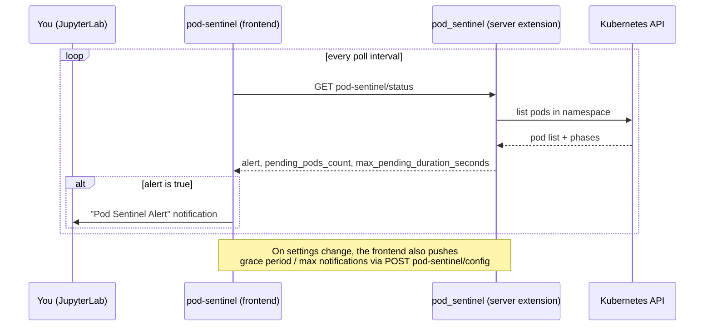

# Pod Sentinel


**Stop guessing why your Spark job is stuck — Pod Sentinel tells you when Kubernetes won't give you the pods you asked for.**

Pod Sentinel is a JupyterLab extension built for [Cloudera AI](https://www.cloudera.com/products/machine-learning.html) runtime environments running **Spark on Kubernetes**. It watches your session's Kubernetes namespace for pods stuck in `Pending`, and when that pattern looks like a resource-quota problem, it pops up a clear, actionable alert — instead of leaving you to stare at a Spark job that silently never gets its executors.

## The problem

When you run Spark on Kubernetes, every executor is its own pod. If your user or group has exceeded its resource quota, the Kubernetes scheduler / Yunikorn won't place new executor pods — they sit in `Pending` indefinitely. From inside a notebook this is invisible: no exception, no stack trace, no log line pointing at "you're out of quota." Your `spark-submit` or `.collect()` just... never finishes. Pod Sentinel exists to close that observability gap and turn a confusing hang into a clear diagnosis.

## What it does

- Periodically checks your namespace for pods stuck in `Pending`.
- Applies a configurable **grace period** so brief, normal scheduling delays don't trigger noise.
- Once a pod has been pending long enough, surfaces an in-JupyterLab alert explaining what's likely happening and how to resolve it.
- Caps how many times it will alert on the same pod, so a job stuck for hours doesn't spam you with repeat notifications.
- Everything above is configurable live from the JupyterLab Settings Editor — no restart, no config file editing.

## How it works

Pod Sentinel is two cooperating halves:

- **Frontend** — the `pod-sentinel` npm package. A JupyterLab plugin that polls the server extension on a timer and shows a JupyterLab alert whenever the backend reports one is warranted. It also watches the JupyterLab Settings Editor and keeps the backend's grace period / notification cap in sync whenever you change them.
- **Backend** — the `pod_sentinel` Python package. A Jupyter Server extension that, on each request, lists the pods in the current Kubernetes namespace (using the notebook pod's own in-cluster service account) and tracks how long each `Pending` pod has been waiting. Once a pod has been pending longer than the grace period it becomes alert-eligible; the backend also enforces the per-pod notification cap so it won't re-report a pod indefinitely.



The alert decision itself always lives on the backend, next to the state it's tracking — the frontend never guesses; it only displays what the server tells it.

## Settings

Configure Pod Sentinel from **Settings → Settings Editor → Pod Sentinel** in JupyterLab:

| Setting | Default | Description |
|---|---|---|
| Enable Pod Sentinel Polling | `true` | Turn monitoring on or off entirely. |
| Polling Interval | `45` seconds | How often the extension checks your namespace for pending pods. |
| Grace Period | `60` seconds | How long a pod may sit `Pending` before it's treated as a candidate for an alert. |
| Max Notifications Per Pod | `2` | How many times a single stuck pod can trigger an alert before Pod Sentinel stops reporting on it. |

Changes take effect immediately.

## Requirements

- JupyterLab >= 4.0.0
- A Jupyter Server running **inside a Kubernetes pod**, with its service account granted permission to `list` pods in its own namespace (Pod Sentinel authenticates via the standard in-cluster service account, the same way `kubectl` would from inside the cluster).
## Install

```bash
pip install pod_sentinel
```

## Uninstall

```bash
pip uninstall pod_sentinel
```

## Troubleshoot

If you see the frontend extension but it doesn't seem to be doing anything, check that the server extension is enabled:

```bash
jupyter server extension list
```

If the server extension is installed and enabled, but you don't see the frontend extension, check that it's installed:

```bash
jupyter labextension list
```

If you never get an alert even when Spark jobs are visibly stuck:
- Confirm polling is enabled in the JupyterLab Settings Editor (Pod Sentinel section).
- Confirm the notebook pod's service account can `list` pods in its namespace — without that permission, the backend can't see pending pods at all.
- Check the browser console: the frontend logs each poll cycle (pending pod count, alert status) and any request failures.

## Contributing

This extension is composed of a Python package named `pod_sentinel` for the server extension and an npm package named `pod-sentinel` for the frontend extension. If you'd like to contribute, see the [Contributing Guide](CONTRIBUTING.md).

## License

[BSD-3-Clause](LICENSE)
